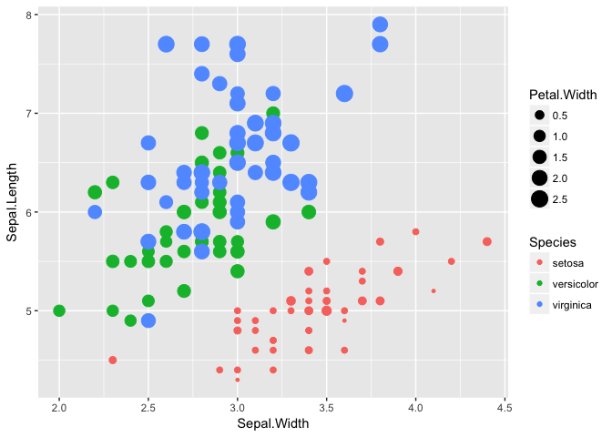

<!-- README.md is generated from README.Rmd. Please edit that file -->
ggbash: a faster way to write ggplot2
=====================================

[](https://travis-ci.org/caprice-j/ggbash) [](https://ci.appveyor.com/project/caprice-j/ggbash) [](https://codecov.io/gh/caprice-j/ggbash) [](https://coveralls.io/github/caprice-j/ggbash) [](https://codeclimate.com/github/caprice-j/ggbash)

ggbash provides a bash-like REPL environment for [ggplot2](https://github.com/tidyverse/ggplot2).

Usage
-----

``` bash
library(ggbash)
ggbash(iris) # start a ggbash session (using iris as main dataset)
```

``` bash
user@host currentDir (iris) $ p Sepal.W Sepal.L c=Sp siz=Petal.W
```

``` r
executed:
    ggplot(iris) +
    geom_point(aes(Sepal.Width,
                   Sepal.Length,
                   color=Species,
                   size=Petal.Width))
```



Features
--------

### 1. Column Index Match

``` bash
# 'ls' checks column indices
user@host currentDir (iris) $ ls

    1: Sepal.L  (ength)
    2: Sepal.W  (idth)
    3: Petal.L  (ength)
    4: Petal.W  (idth)      
    5: Spec     (ies)

# the same as the above 'p Sepal.W Sepal.L c=Sp si=Petal.W'
user@host currentDir (iris) $ p 2 1 c=5 si=4

# you can mix both notations
user@host currentDir (iris) $ p 2 1 c=5 si=Petal.W
```

### 2. Partial Match

In the first example, ggbash performs partial matches seven times.

-   **geom names**
    -   `p` matches `geom_point`.
-   **column names**
    -   `Sepal.W` matches `iris$Sepal.Width`.

    -   `Sepal.L` matches `iris$Sepal.Length`.

    -   `Sp` matches `iris$Species`.

    -   `Petal.W` matches `iris$Petal.Width`.

-   **aesthetics names**
    -   `c` matches `color`, which is the aesthetic of geom\_point.
    -   `si` matches `size` ('s' is ambiguous within 'shape', 'size', and 'stroke').

### 3. Piping to copy/save results

``` r
    user@host currentDir (iris) $ cd imageDir

    user@host imageDir (iris) $ p 2 1 c=5 si=4 | png big
    saved as 'iris-Sepal.W-Sepal.L-Sp.png' (big: 1960 x 1440)
    
    user@host imageDir (iris) $ for (i in 2:5) p 1 i | pdf 'iris-for'
    saved as 'iris-for.pdf' (default: 960 x 960)
    
    user@host imageDir (iris) $ p 1 2 c=spec size=4 | copy
    copied to clipboard:
    ggplot(iris) + geom_point(aes(x=Sepal.Length,
                                  y=Sepal.Width,
                                  colour=Species,
                                  size=Petal.Width))
```

Installation
------------

``` r
devtools::install_github("caprice-j/ggbash")
```

Goals
-----

ggbash has two main goals:

1.  Provide blazingly fast way to do Exploratory Data Analysis.

    -   less typing by partial and fuzzy match

    -   save plots with auto-generated file names

2.  Make it less stressful to finalize your plots.

    -   adjust colors

    -   rotate axis labels

    -   decide tick label intervals

    -   generate line-wrapped titles
